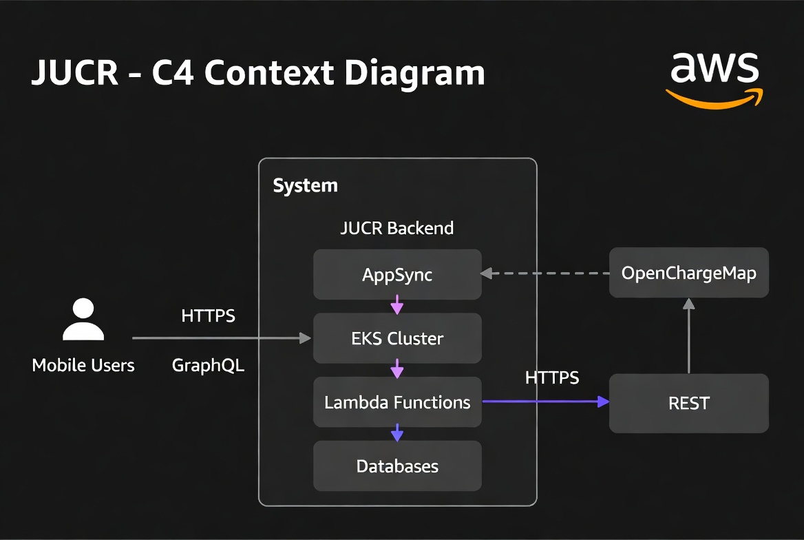
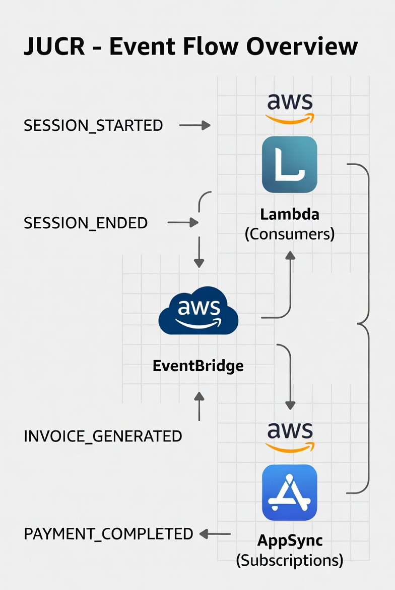
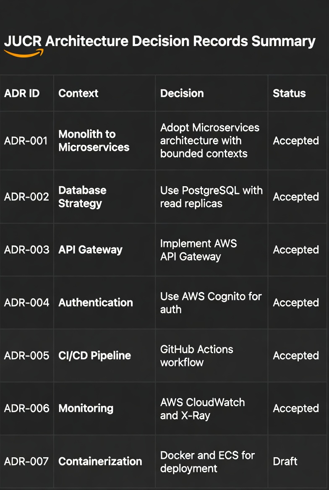

# JUCR EV Charging Platform - General Architecture Overview

## 1. Project Overview
JUCR is a Berlin-based deep-tech startup founded in 2020 that offers a global flat-rate subscription for electric vehicle charging, giving users access to more than 250,000 charging points worldwide. The core business goal is to deliver a seamless, reliable, and real-time charging experience where drivers never have to worry about location, price, or availability.

The technical challenge requires building a scalable, resilient backend that integrates the OpenChargeMap (OCM) API as the source of truth for charging stations (POIs), supports user management, charging sessions, PCI-compliant billing, and real-time notifications.

This document presents the complete proposed architecture, the rigorous reasoning behind every major decision, and how the design fully addresses the JUCR Backend Engineer Technical Assessment deliverables.

## 2. Solution Summary
We propose a **hybrid cloud-native architecture** that combines Amazon EKS for long-running stateful services, AWS Lambda for event-driven workloads, AWS AppSync as the single GraphQL entry point, and a layered persistence strategy (Redis cache + MongoDB OCM mirror + Aurora PostgreSQL transactional database).

This design follows Twelve-Factor App principles [1], Domain-Driven Design bounded contexts, and event-driven choreography to achieve optimal scalability, cost efficiency, and maintainability.

## 3. Complete System Architecture Diagram (Full System View)

**Technical explanation:**
The diagram shows the complete end-to-end flow: mobile clients connect exclusively to AWS AppSync (GraphQL + WebSocket for subscriptions). AppSync federates subgraphs from the EKS cluster and routes mutations to Lambda functions. The EKS cluster hosts the three stateful domain services with Deployments, HPA, and ClusterIP Services. Lambda functions handle Auth, Billing, and the periodic OCM Sync Worker (triggered by EventBridge). The central Event Bus (SNS + SQS + EventBridge) decouples all components. The persistence layer consists of Redis (cache), MongoDB (OCM mirror), and Aurora PostgreSQL (transactional data with read replicas).

**Justification:**
This is the single source of truth for the entire system. The deliberate separation between EKS (persistent connections and state) and Lambda (short-lived, event-driven tasks) is a fundamental architectural decision that optimizes both performance and cost while maintaining clear boundaries.

## 4. C4 Context Diagram

**Technical explanation:**
This C4 Context diagram defines the system boundary clearly. Mobile Users interact with the JUCR Backend via GraphQL. The backend contains AppSync, EKS Cluster, Lambda Functions, and Databases. OpenChargeMap is shown as an external system, justifying the need for our local mirror.

**Justification:**
The C4 Context view is essential for stakeholders and new team members. It highlights that OpenChargeMap is an external dependency, which directly drives the requirement for a local mirror to comply with OCM’s fair-use policy and rate limits.

## 5. Compute Decision Matrix (ADR-001)

| Service                  | Chosen Compute       | Reason                                                                 | Alternatives Considered          | Why Chosen (Technical Justification) |
|--------------------------|----------------------|------------------------------------------------------------------------|----------------------------------|--------------------------------------|
| Charging Station Service | Amazon EKS           | Persistent TCP connections (OCPP/MQTT), long-lived sessions, real-time state | Fargate, ECS, Lambda             | Fargate lacks StatefulSets, DaemonSets, custom schedulers, and fine-grained NetworkPolicies. Lambda cannot support persistent connections or long-running processes (15-minute limit). EKS gives full control over pod lifecycle, HPA with custom metrics (concurrent OCPP connections), and zero-downtime rolling updates. |
| Session Service          | Amazon EKS           | Real-time session state, WebSocket/MQTT for charger communication, high concurrency | Lambda, Fargate                  | Requires long-running processes and stateful WebSocket connections. Lambda’s cold starts and 15-minute limit make it unsuitable. EKS provides native service discovery, HPA, and rolling updates with zero downtime. |
| User Service             | Amazon EKS           | Profile, vehicle, wallet operations with moderate concurrency and future growth | Lambda (if very simple)          | Although CRUD-heavy, it benefits from EKS for easier integration with other domain services via internal DNS and shared libraries. Allows future expansion without re-architecture. |
| Auth Service             | AWS Lambda           | Short-lived authentication flows (register/login/token refresh)        | EKS, Cognito only                | Pure event-driven, < 2 seconds execution. Lambda + AppSync Authorizer gives instant scaling, zero idle cost, and native JWT handling. Running on EKS would add unnecessary operational overhead. |
| Billing Service          | AWS Lambda           | Triggered by SESSION_ENDED event; short calculation + payment processing | Step Functions, EKS              | Pure event-driven, stateless, < 5 seconds. Lambda is the cheapest and simplest option. Step Functions would add unnecessary orchestration overhead for this simple flow. |
| OCM Sync Worker          | AWS Lambda + EventBridge | Periodic batch synchronization of OCM data (every 6 hours)            | EKS CronJob, Batch               | Pure scheduled job with no persistent state. Lambda + EventBridge is the most cost-effective and reliable solution. No need for always-on containers. |

**ADR-001 Status: Accepted**

## 6. Event Flow Overview

**Technical explanation:**
Key domain events (SESSION_STARTED, SESSION_ENDED, INVOICE_GENERATED, PAYMENT_COMPLETED) are published to the central Event Bus. The Event Bus routes them to Lambda consumers and to AppSync for real-time subscriptions.

**Justification:**
This diagram illustrates the event-driven choreography pattern we selected over orchestration. Choreography provides better resilience and decoupling: if Billing fails, the Session Service continues to operate normally. It also allows us to add new consumers (push notifications, analytics, fraud detection) without changing existing services.

## 7. Architecture Decision Records Summary

**Technical explanation:**
The table summarizes the key ADRs that drove the architecture (compute choice, persistence strategy, GraphQL usage, authentication, CI/CD, etc.).

**Justification:**
Documenting decisions explicitly is a senior engineering practice. This summary allows any engineer or architect to quickly understand why certain technologies were chosen and what trade-offs were made, which is essential for maintainability and future evolution of the platform.

## Technical Concepts Glossary 

[1] **Twelve-Factor App principles** – A set of 12 best practices for building modern cloud applications that are easy to deploy, scale, and maintain. Think of them as “rules for making software that works well in the cloud”.

[2] **Domain-Driven Design (DDD)** – A way of organizing the code around real business concepts (domains) so that different teams can work independently without stepping on each other’s toes.

[3] **Event-driven choreography** – Instead of one central controller telling everything what to do, each part of the system sends messages (“events”) when something important happens, and other parts react automatically. It’s like a team where everyone knows their role and communicates through notes rather than waiting for orders from a boss.

[4] **Idempotent upserts** – A safe way to update or insert data so that even if the same operation is repeated (for example, because of a network failure), the result is the same and no duplicate data is created.

[5] **Hybrid persistence strategy** – Using two different databases for different types of data: one for money-related and important records (Aurora), and another for fast searches of station information (MongoDB). This is like having a secure vault for money and a fast library for looking up books.

[6] **Multi-AZ high availability** – The system runs in multiple different data centers at the same time so that if one data center has a problem, the others keep everything running without interruption.

