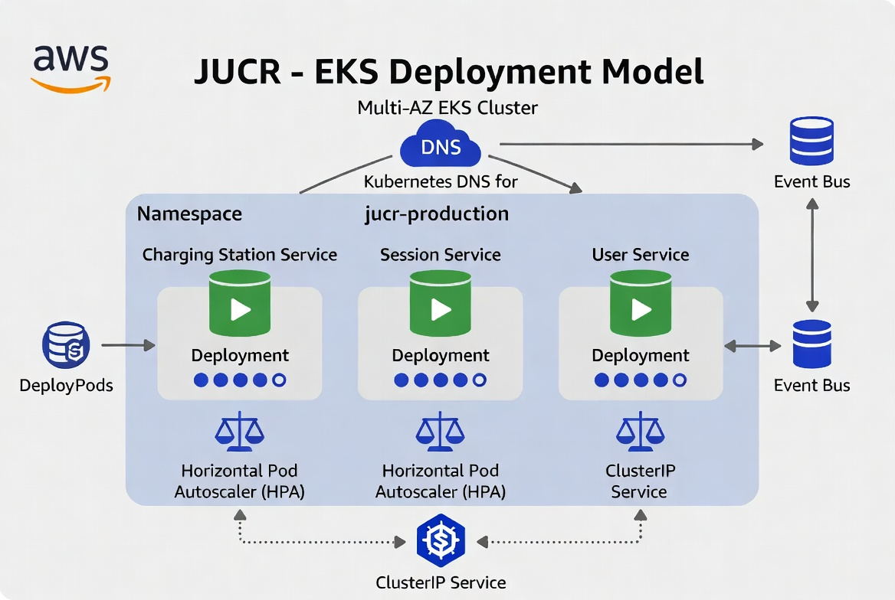
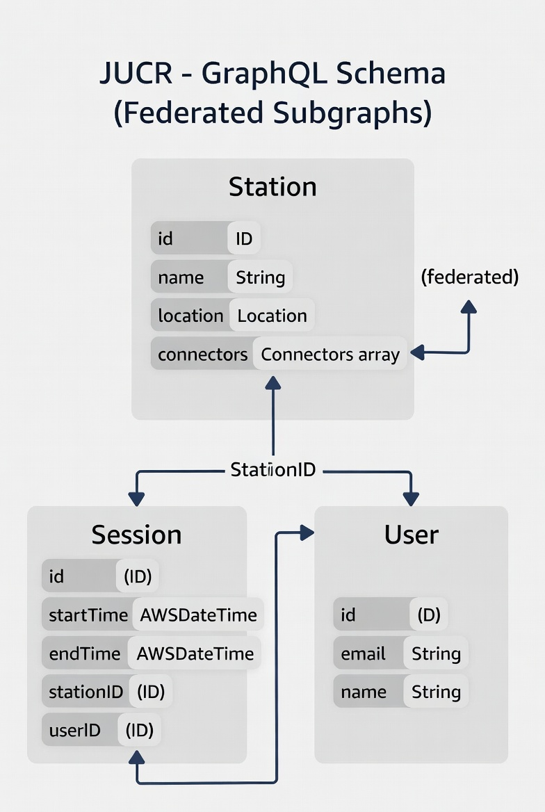
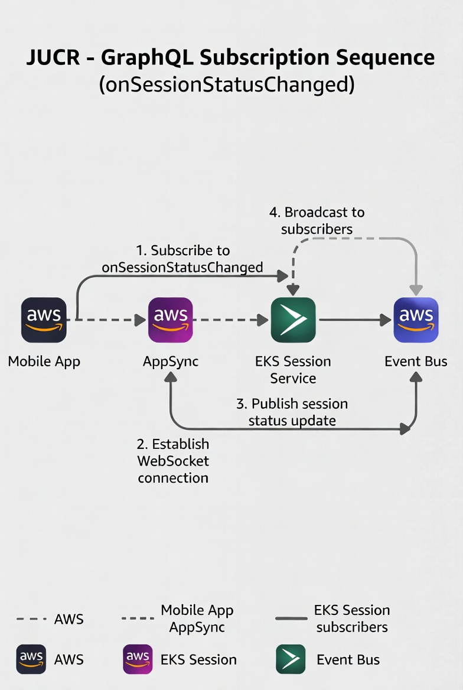
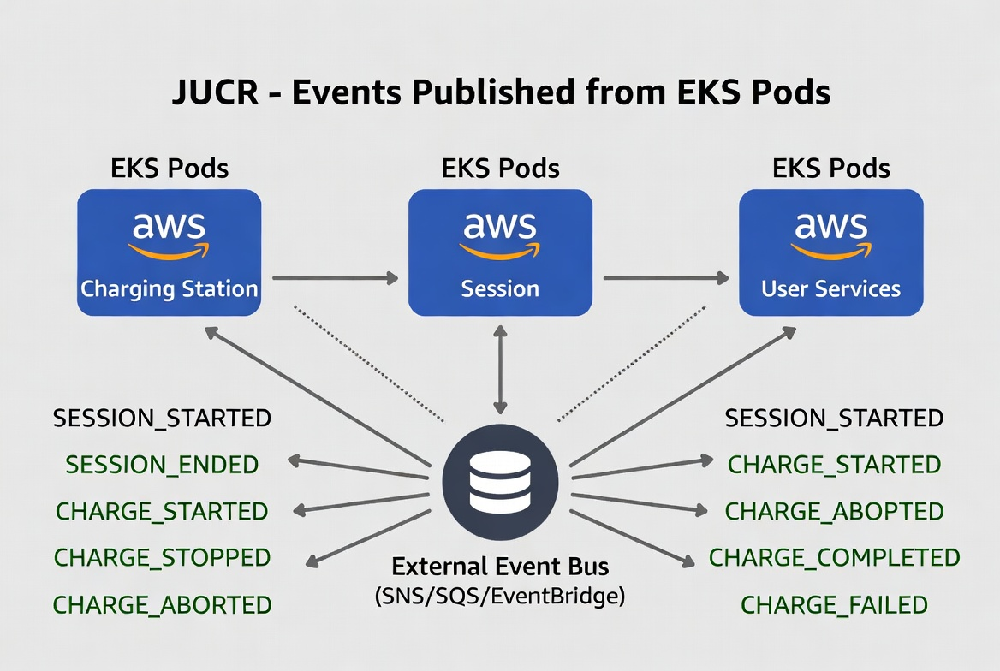
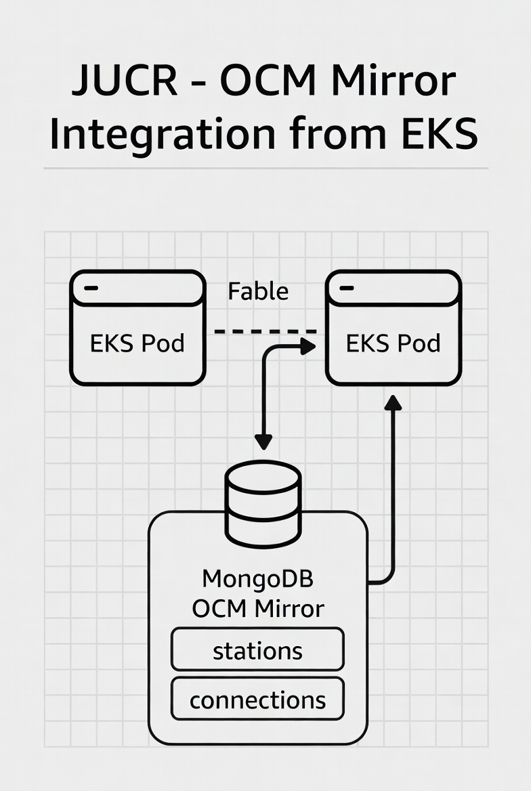

# JUCR - EKS Cluster Detail

## 1. Introduction and Architectural Context

The long-running and stateful microservices of JUCR (Charging Station Service, Session Service, and User Service) are deployed on Amazon Elastic Kubernetes Service (EKS). These services require persistent TCP connections (OCPP 1.6/2.0.1 and MQTT), real-time session management, high concurrency, and domain-specific scaling.

Kubernetes on EKS was chosen because it provides native primitives for deployment orchestration, auto-healing, service discovery, fine-grained horizontal scaling, and advanced networking. These capabilities would be significantly harder and more expensive to achieve with Fargate or plain ECS for this type of workload.

This document explains in detail the deployment model, GraphQL contracts, event publishing, OCM mirror integration, and the senior-level reasoning behind every decision.

## 2. EKS Deployment Model



### Step-by-step explanation of the diagram

1. The EKS cluster runs in multiple Availability Zones for high availability.
2. Inside the `jucr-production` namespace there are three independent Deployments (one per domain service).
3. Each Deployment manages 3-40 replicas (pods) depending on load.
4. A ClusterIP Service sits in front of each Deployment to provide internal load balancing.
5. The Horizontal Pod Autoscaler (HPA) automatically adjusts replicas based on CPU and custom metrics (for example, concurrent OCPP connections and queue length).
6. All pods publish domain events to the external Event Bus.

### Justification

EKS was selected over Fargate because Fargate does not support advanced Kubernetes features such as StatefulSets, DaemonSets, custom schedulers, NetworkPolicies, or full integration with Helm/Operators/ArgoCD. For services that maintain long-lived TCP connections to physical chargers and need real-time WebSocket/MQTT handling, the control and flexibility of a full Kubernetes cluster is essential. The multi-AZ setup and HPA ensure traffic spikes can be handled while keeping costs optimized.

### Example YAML (Charging Station Deployment)

```yaml
apiVersion: apps/v1
kind: Deployment
metadata:
  name: charging-station
spec:
  replicas: 5
  selector:
    matchLabels:
      app: charging-station
  template:
    metadata:
      labels:
        app: charging-station
    spec:
      serviceAccountName: charging-station-sa
      containers:
      - name: charging-station
        image: 123456789012.dkr.ecr.us-east-1.amazonaws.com/charging-station:latest
        resources:
          requests:
            cpu: "500m"
            memory: "1Gi"
          limits:
            cpu: "2"
            memory: "4Gi"
        livenessProbe:
          httpGet:
            path: /healthz
            port: 8080
          initialDelaySeconds: 30
          periodSeconds: 10
        readinessProbe:
          httpGet:
            path: /ready
            port: 8080
          initialDelaySeconds: 5
          periodSeconds: 5
```

## 3. GraphQL Schema (Federated Subgraphs)



### Step-by-step explanation of the diagram

The diagram shows the main GraphQL types exposed by the federated subgraphs running in EKS:

- `Station`: `id`, `ocmId`, `name`, `address`, `latitude`, `longitude`, `connectors[]`, `status`, `usageCost`
- `Connector`: `type`, `powerKW`, `quantity`
- `Session`: `id`, `userId`, `stationId`, `startTime`, `endTime`, `energyKWh`, `cost`, `status`
- `User`: `id`, `email`, `name`, `vehicles`, `walletBalance`

Key mutations:

- `startSession`
- `updateSession`
- `endSession`
- `payInvoice`

Key subscription:

- `onSessionStatusChanged(sessionId)`

### Justification

Using GraphQL federation (AppSync + subgraphs in EKS) allows each domain team to own and evolve its schema independently while still providing a unified API to clients. This avoids a dedicated Backend-for-Frontend layer and lets mobile/web clients request exactly the fields they need, reducing over-fetching and improving performance.

## 4. GraphQL Subscription Sequence



### Step-by-step explanation of the diagram

1. Mobile app subscribes to `onSessionStatusChanged(sessionId)` via AppSync.
2. AppSync maintains a WebSocket connection.
3. When Session Service in EKS updates the session status, it publishes an event to the Event Bus.
4. The Event Bus notifies AppSync.
5. AppSync pushes the real-time update to subscribed clients.

### Justification

Real-time session updates are a core JUCR requirement. GraphQL subscriptions over WebSocket are the most efficient and standard way to deliver this experience. Publishing events from EKS to an external Event Bus keeps services decoupled from AppSync and enables adding new subscribers without changing core Session logic.

## 5. Events Published from EKS Pods



### Step-by-step explanation of the diagram

EKS pods (from all three services) publish standardized events to the external Event Bus:

- `SESSION_STARTED`
- `SESSION_UPDATED`
- `SESSION_ENDED`
- `INVOICE_GENERATED`
- `PAYMENT_COMPLETED`
- `OCM_SYNC_COMPLETED` (from Charging Station Service)

Each event includes `eventType`, `timestamp`, and domain-specific payload.

### Justification

Standardized events are the glue of the hybrid architecture. Publishing from EKS to a managed external Event Bus enables decoupling, event-driven choreography, and easier long-term scalability/maintainability.

## 6. OCM Mirror Integration from EKS



### Step-by-step explanation of the diagram

Charging Station Service pods query the MongoDB OCM Mirror for POI data (`stations` + `connections`). This is the primary source for location-based searches and station status.

### Justification

Querying the local mirror instead of calling public OCM APIs per request is mandatory for performance and cost control. MongoDB is a strong fit because POI data is semi-structured and benefits from flexible indexing (geo, status, operator). EKS pods read with low latency while the sync worker keeps data fresh.

## 7. Kubernetes Security and Operational Best Practices

- IAM Roles for Service Accounts (IRSA): each Deployment uses a dedicated ServiceAccount with least-privilege IAM roles.
- NetworkPolicies: restrict pod-to-pod and pod-to-external traffic.
- Secrets Management: AWS Secrets Manager + Secrets Store CSI Driver.
- Pod Security Standards: enforced at namespace level.
- Monitoring: Prometheus + CloudWatch Container Insights for pod-level metrics.

## Technical Concepts Glossary 

1. **Twelve-Factor App principles**  
   A set of 12 best practices for building cloud applications that are easier to deploy, scale, and maintain.
2. **Domain-Driven Design (DDD)**  
   A way to organize code around business domains so teams can work independently with clear boundaries.
3. **Event-driven choreography**  
   Instead of one central controller, each service publishes events and other services react to them.
4. **Idempotent upserts**  
   A safe write pattern where repeating the same operation does not create duplicates or inconsistent state.
5. **Hybrid persistence strategy**  
   Using different databases for different workloads (for example, Aurora for transactional data and MongoDB for POI search).
6. **Multi-AZ high availability**  
   Running across multiple data centers so the system keeps working if one AZ fails.
