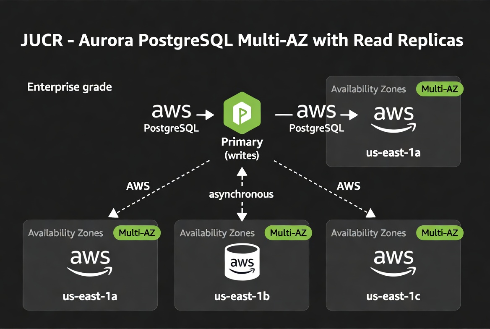
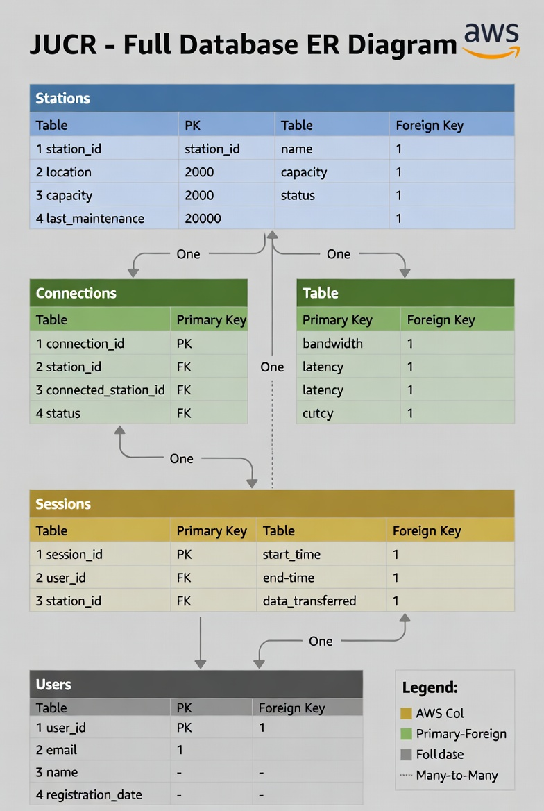
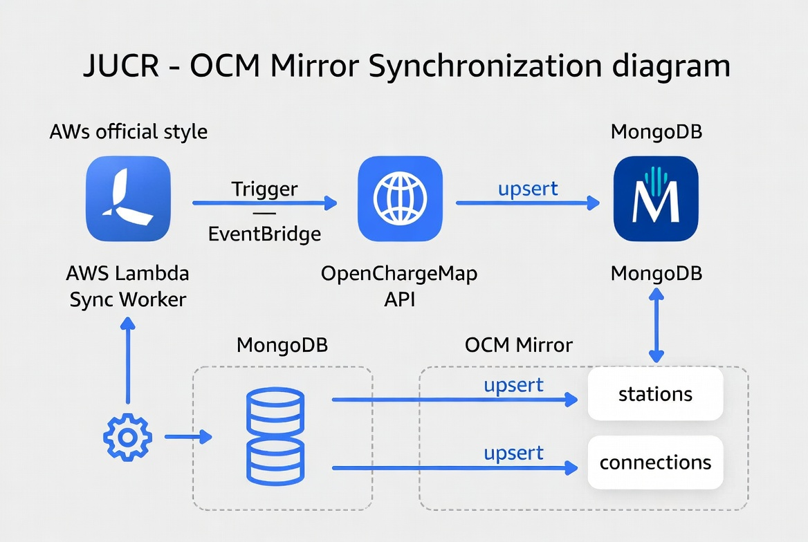

# JUCR - Database & Cache Layer Detail

## 1. Introduction & Architectural Context
The persistence layer is one of the most critical components of the JUCR platform. It must support two fundamentally different access patterns:

- High-frequency read operations (POI searches by location, connector type, status, etc.)
- Strong transactional consistency for sessions, billing, wallet balance, and user data

Because these patterns have conflicting requirements (speed + flexibility vs. ACID guarantees + complex joins), we chose a **hybrid persistence strategy** instead of forcing everything into a single database.

This document explains in detail why we use **Amazon Aurora PostgreSQL** as the primary transactional database, **MongoDB** exclusively as the local OCM mirror, **Redis** as the cache layer, and how the OpenChargeMap mirror works.

## 2. Aurora PostgreSQL – The Primary Transactional Database

**Step-by-step explanation of the diagram:**
1. All write operations (INSERT, UPDATE, DELETE) go exclusively to the Primary instance.
2. The Primary asynchronously replicates data to up to 15 Read Replicas distributed across multiple Availability Zones.
3. Read-heavy queries (list active sessions, user wallet balance, station details) are routed to the Read Replicas.
4. In case of Primary failure, Aurora automatically promotes one of the replicas to Primary with minimal downtime (< 30 seconds).

**Justification:**
Aurora PostgreSQL was chosen as the main database because the domain requires strong ACID transactions (e.g., ending a session must atomically calculate cost, generate invoice, and update wallet balance). We need complex joins (sessions + stations + users + invoices). Aurora allows us to scale reads independently of writes with read replicas and provides automatic failover with minimal downtime.

Aurora Serverless v2 was considered but discarded for production workloads because a provisioned cluster offers more predictable performance and better support for connection pooling and advanced features.

## 3. MongoDB – The OCM Mirror Only

MongoDB is used **exclusively** for the local mirror of OpenChargeMap data (POIs).

**Why MongoDB for the mirror?**
- OCM data is semi-structured (nested AddressInfo, Connections array, OperatorInfo, StatusType, etc.).
- The most common queries are geo-spatial (“stations within X km”) and filter-based.
- MongoDB excels at these queries with 2dsphere indexes and flexible document structure.
- No need for ACID transactions or complex joins for POI data.

**The OpenChargeMap Mirror Strategy**
OpenChargeMap’s public API has strict rate limits and explicitly recommends hosting a local mirror for high-volume usage. To comply with this and avoid being throttled, we maintain a local MongoDB mirror that is synchronized periodically by a Lambda worker. This reduces latency, cost, and external dependency.

**MongoDB OCM Mirror Collection Structure**
- `_id`: UUIDv4 (generated)
- `externalId`: OCM ID (unique index)
- Full raw OCM POI structure (AddressInfo, Connections array, OperatorInfo, StatusType, etc.)
- Indexes: 2dsphere geo index on location, unique index on externalId for idempotent upserts

**OCM Mirror Synchronization**
EventBridge Cron triggers the Lambda Sync Worker every 6 hours. The Lambda calls the OpenChargeMap /poi endpoint and performs idempotent upserts into MongoDB.

## 4. Full Database Entity-Relationship Diagram

**Detailed Table Schemas (Aurora PostgreSQL)**

**stations**
| Column            | Type       | Description                                      |
|-------------------|------------|--------------------------------------------------|
| id                | UUID (PK)  | Internal station ID                              |
| ocm_id            | Integer    | OCM identifier (unique index)                    |
| name              | String     | Station title                                    |
| address_line      | String     | AddressLine1 from OCM                            |
| town              | String     | Town from OCM                                    |
| state             | String     | State/Province                                   |
| country           | String     | Country ISO code                                 |
| latitude          | Float      | Latitude                                         |
| longitude         | Float      | Longitude                                        |
| status            | String     | Operational status                               |
| usage_type        | String     | Usage conditions                                 |
| usage_cost        | String     | Cost information                                 |
| number_of_points  | Integer    | Total connectors                                 |
| last_verified     | Timestamp  | Last OCM verification                            |

**connections**
| Column       | Type       | Description                                      |
|--------------|------------|--------------------------------------------------|
| id           | UUID (PK)  | Internal connector ID                            |
| station_id   | UUID (FK)  | Reference to station                             |
| type         | String     | Connector type                                   |
| level        | Integer    | Charging level                                   |
| power_kw     | Float      | Maximum power                                    |
| quantity     | Integer    | Number of connectors                             |

**sessions**
| Column        | Type       | Description                                      |
|---------------|------------|--------------------------------------------------|
| id            | UUID (PK)  | Session ID                                       |
| user_id       | UUID (FK)  | User who started the session                     |
| station_id    | UUID (FK)  | Station where the session occurred               |
| start_time    | Timestamp  | Start timestamp                                  |
| end_time      | Timestamp  | End timestamp (nullable)                         |
| energy_kwh    | Numeric    | Energy consumed in kWh                           |
| cost          | Numeric    | Final cost                                       |
| status        | String     | Status (IN_PROGRESS, COMPLETED, etc.)            |

**users**
| Column         | Type       | Description                                      |
|----------------|------------|--------------------------------------------------|
| id             | UUID (PK)  | User ID                                          |
| email          | String (UNIQUE) | Email address                               |
| name           | String     | Full name                                        |
| password_hash  | String     | Hashed password                                  |
| wallet_balance | Numeric    | Available balance                                |

**invoices**
| Column         | Type       | Description                                      |
|----------------|------------|--------------------------------------------------|
| id             | UUID (PK)  | Invoice ID                                       |
| session_id     | UUID (FK)  | Related session                                  |
| user_id        | UUID (FK)  | User who must pay                                |
| amount         | Numeric    | Total amount                                     |
| currency       | String     | Currency (e.g., EUR)                             |
| due_date       | Date       | Due date                                         |
| status         | String     | Status (PENDING, PAID, OVERDUE)                  |

## 5. Cache-First Flow

**Step-by-step explanation:**
EKS pods always check Redis first. On cache hit → immediate response. On cache miss → query Aurora or MongoDB and populate Redis with TTL. Writes always go to the primary database and invalidate/update the cache.

**Redis TTL & Invalidation Strategy:**
- Stations list: TTL 5 minutes (refreshed on OCM sync)
- Active sessions: TTL 1 hour or manual invalidation on session end
- Cache invalidation: write-through on session updates + pub/sub from Event Bus

## 6. OCM Mirror Synchronization

**Step-by-step explanation:**
1. EventBridge Cron triggers the Lambda Sync Worker every 6 hours.
2. Lambda calls the OpenChargeMap /poi endpoint.
3. Lambda performs idempotent upserts into MongoDB.
4. Publishes `OCM_SYNC_COMPLETED` event.

**Justification:**
Hosting a local mirror is mandatory to respect OpenChargeMap’s rate limits and reduce latency. Lambda + EventBridge is the most cost-effective solution for this periodic job.

## 7. Recommendations & Future Improvements
- Redis Cluster for higher availability
- Aurora Global Database for multi-region expansion
- Partitioning on sessions table by date or region for high write volumes
- Encryption at rest (KMS) and in transit (TLS) for all databases
- Automated snapshots + cross-region backups for disaster recovery
- IAM roles and least-privilege access controls

This hybrid layer is designed to scale to millions of daily POI queries and thousands of concurrent sessions while maintaining strong consistency where it matters most.

## Technical Concepts Glossary 

[1] **Hybrid persistence strategy** – Using two different databases for different types of data: one for money-related and important records (Aurora), and another for fast searches of station information (MongoDB). This is like having a secure vault for money and a fast library for looking up books.

[2] **ACID transactions** – A set of properties that guarantee that database operations are processed reliably (Atomicity, Consistency, Isolation, Durability). Essential for billing and wallet updates so money is never lost or duplicated.

[3] **Read replicas** – Copies of the main database that can handle read requests to reduce load on the main server.

[4] **Idempotent upserts** – A safe way to update or insert data so that repeating the same operation doesn’t create duplicates.

[5] **TTL (Time To Live)** – A setting that automatically deletes data from the cache after a certain time so it stays fresh.

[6] **Multi-AZ high availability** – The system runs in multiple different data centers at the same time so that if one data center has a problem, the others keep everything running without interruption.
