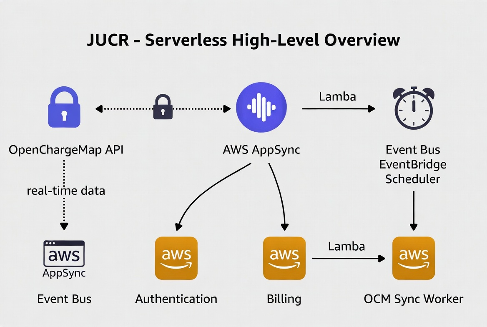
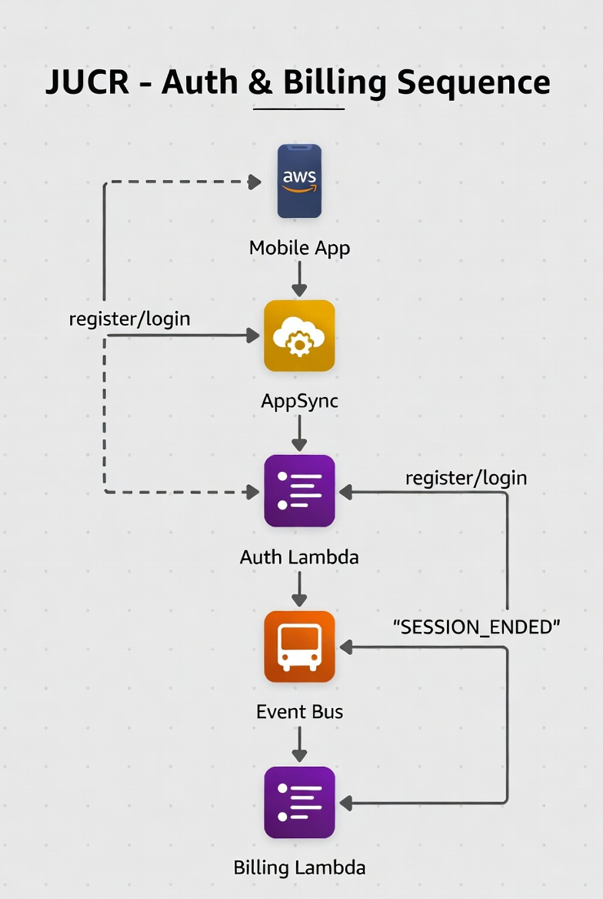
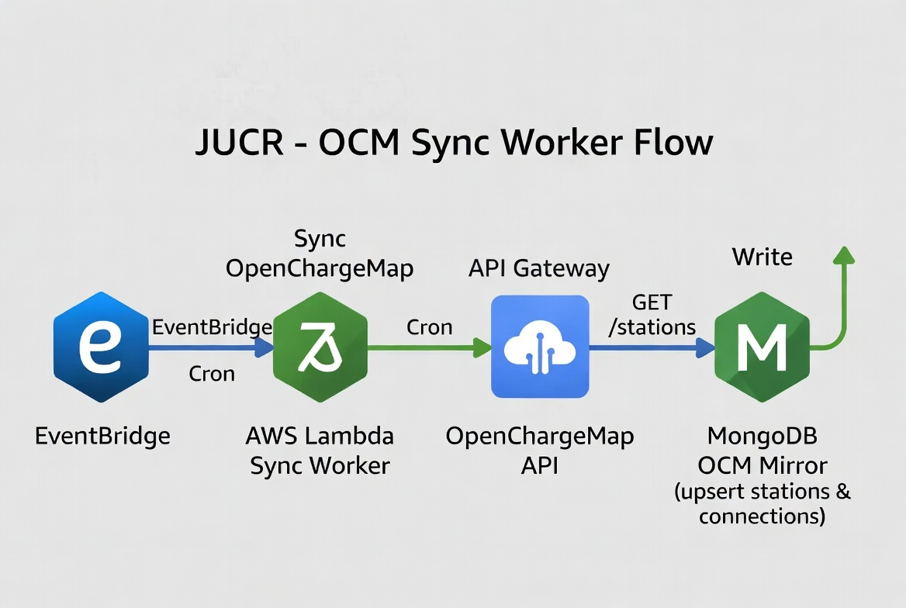
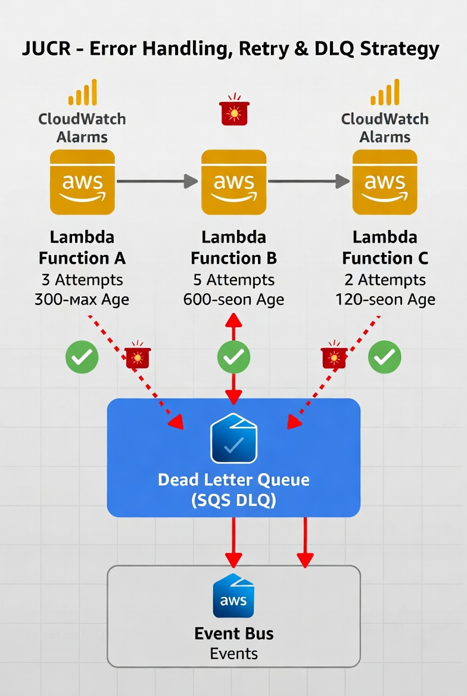

# JUCR - Serverless Functions & Events Detail

## 1. Introduction & Architectural Context
The serverless layer is the event-driven backbone of the JUCR platform. It is responsible for all short-lived, high-frequency and asynchronous operations that do not require persistent state or long-running connections.

This layer was deliberately separated from the EKS cluster to achieve maximum cost efficiency, instant scaling, minimal operational overhead, and native support for real-time GraphQL subscriptions via AppSync.

This document provides a detailed, senior-level explanation of each component, the reasoning behind every design decision, and a step-by-step walkthrough of each diagram.

## 2. High-Level Serverless Architecture



**Step-by-step explanation of the diagram:**
1. Mobile and web clients connect exclusively to AWS AppSync as the single GraphQL entry point.
2. AppSync handles authentication via Authorizer and routes mutations/queries to the appropriate Lambda functions.
3. The OCM Sync Worker Lambda is triggered on a schedule by Amazon EventBridge.
4. All Lambda functions publish standardized domain events to the central Event Bus.
5. The Event Bus feeds real-time GraphQL subscriptions back to connected clients through AppSync.

**Justification:**
This high-level view is the cornerstone of the serverless design. We chose AppSync + Lambda + Event Bus because it is AWS’s recommended pattern for event-driven applications in 2026. Lambda is used for everything short-lived (< 5 seconds) to achieve zero idle cost and instant scaling. Keeping the Event Bus external to EKS ensures true decoupling between the stateful services and the serverless layer, allowing independent scaling and easier addition of new consumers in the future.

## 3. Auth & Billing Sequence



**Step-by-step explanation of the diagram:**
1. The mobile app sends a register or login mutation to AppSync.
2. AppSync invokes the Auth Lambda.
3. Auth Lambda validates credentials, generates JWT tokens, and publishes a `USER_REGISTERED` event.
4. When a charging session ends, the Session Service publishes a `SESSION_ENDED` event to the Event Bus.
5. The Event Bus routes the event to the Billing Lambda.
6. Billing Lambda calculates the cost, generates an invoice, updates the wallet, and publishes `PAYMENT_COMPLETED` or `INVOICE_GENERATED`.

**Justification:**
This sequence diagram demonstrates the event-driven choreography pattern we selected over orchestration with Step Functions. Choreography provides better resilience and decoupling: if Billing fails, the Session Service continues to operate normally. It also allows us to add new consumers (push notifications, email, analytics, fraud detection) without touching the core Billing code. This pattern is fundamental for a platform that must evolve rapidly while maintaining high reliability.

## 4. OCM Sync Worker Flow



**Step-by-step explanation of the diagram:**
1. Amazon EventBridge Cron triggers the Sync Worker Lambda every 6 hours (configurable).
2. The Lambda calls the OpenChargeMap `/poi` endpoint with optimized parameters.
3. The Lambda parses the JSON and performs idempotent upserts into the MongoDB OCM Mirror.
4. After successful synchronization, it publishes an `OCM_SYNC_COMPLETED` event.

**Justification:**
Hosting a local mirror is a hard requirement from OpenChargeMap’s usage policy. Using Lambda + EventBridge is the most cost-effective and operationally simple solution for a periodic batch job. The idempotent upsert (based on `ocm_id`) ensures data consistency even if the job is retried after a failure. This design keeps the public API usage minimal and the mirror always fresh.

## 5. Error Handling, Retry & DLQ Strategy



**Step-by-step explanation of the diagram:**
1. Every Lambda has a configured retry policy (3–5 attempts with exponential backoff).
2. After all retries fail, the message is moved to a Dead Letter Queue (SQS DLQ).
3. CloudWatch alarms notify the team when messages land in the DLQ.
4. A reconciliation process consumes the DLQ and publishes compensating events.

**Justification:**
In a production EV charging system, losing a `SESSION_ENDED` event could mean lost revenue. The combination of retries + DLQ + alarms is the industry-standard pattern to guarantee at-least-once delivery with visibility and recoverability. This approach satisfies both operational reliability and audit/compliance requirements.

## 6. Contracts and Payloads

**Auth Service (Register / Login)**
```json
// Register
{
  "email": "user@example.com",
  "name": "John Doe",
  "password": "SecurePass123",
  "vehicle": { "brand": "Tesla", "model": "Model 3", "batteryCapacity": 75 }
}

// Login
{
  "email": "user@example.com",
  "password": "SecurePass123"
}
```

**Billing Event Payload**
```json
{
  "eventType": "SESSION_ENDED",
  "sessionId": "6fe27f6e-ff2d-4dda-9f86-3de70e1a4bbf",
  "userId": "0b1732fa-631a-4952-b6d6-2d586ed9dbf8",
  "stationId": "48f8fb15-814d-4e9d-97e1-d2caea2a162f",
  "energyKwh": 22.4,
  "durationMinutes": 58,
  "endedAt": "2026-02-21T14:31:00Z"
}
```

**OCM Sync Completion Payload**
```json
{
  "eventType": "OCM_SYNC_COMPLETED",
  "source": "ocm-sync-worker",
  "startedAt": "2026-02-21T06:00:00Z",
  "finishedAt": "2026-02-21T06:02:18Z",
  "processed": 25000,
  "updated": 418,
  "failed": 0
}
```

## 7. Operational Guardrails
- Enforce strict schema validation for incoming mutation payloads at AppSync resolvers and Lambda boundaries.
- Use idempotency keys for billing-side writes to avoid duplicate charges during retries.
- Keep retry budgets bounded; use DLQ for non-transient failures and alert on queue depth.
- Avoid logging sensitive payloads (PII, payment details); log structured metadata only.

## 8. Recommendations & Future Improvements
- Introduce contract versioning for event payloads to support independent producer/consumer evolution.
- Add replay tooling for DLQ messages with safety checks and audit logs.
- Add regional failover strategy for event routing and subscription delivery.
- Define SLOs for end-to-end event latency and alert on error budget burn.

## Technical Concepts Glossary

[1] **Event-driven choreography** - Services react to published events rather than being orchestrated by a central workflow controller.

[2] **DLQ (Dead Letter Queue)** - A queue where messages are moved after retry attempts are exhausted.

[3] **Idempotency** - Repeating the same operation has the same final result, preventing duplicate side effects.

[4] **At-least-once delivery** - Messaging guarantee where consumers may receive duplicate messages and must handle them safely.
